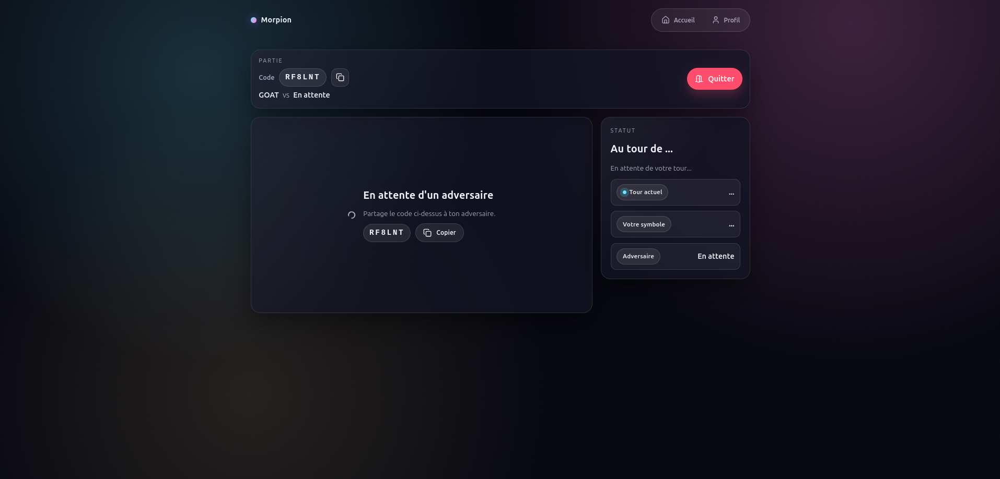
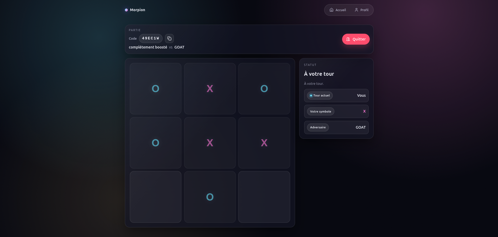

# Morpion (TD4 VueJS)

Application Vue 3 / Vue Router pour le TD4 : création de parties, rejoindre/jouer via WebSockets et �dition du profil.

## Aper�u
- UI/UX moderne (glassmorphism, layout dense, responsive)
- Temps réel via WebSockets + fallback polling
- Profils joueurs + noms dynamiques

## Pr�-requis
- Node.js 20+ (voir `package.json` > `engines`)
- npm (fourni avec Node)
- Une clé API personnelle : `/api/apikeys` sur https://morpion-api.edu.netlor.fr (renseigner `name` et `email`)

## Configuration de la cl� API
1. Créer un fichier `.env` à la racine du projet s'il n'existe pas.
2. Ajouter votre clé :
```env
VITE_MORPION_API_KEY=VOTRE_CLE_ICI
```
Chaque d�veloppeur doit utiliser sa propre cl�.

## Installation
```sh
npm install
```

## Lancement en développement
```sh
npm run dev
```
Vite affiche ensuite l'URL locale (par d�faut `http://localhost:5173`).
Ouvrir deux onglets/navigateurs pour simuler deux joueurs.

### Lancer un 2e joueur (autre cl� API)
```sh
VITE_MORPION_API_KEY='VOTRE_AUTRE_CLE' npm run dev -- --port 5174
```
Ouvrir `http://localhost:5174` pour le second joueur.

## Construction et pr�visualisation (optionnel)
```sh
npm run build
npm run preview
```

## Lint
```sh
npm run lint
```

## Captures d'écran
Ajoutez vos images ici (chemins proposés) :
- Accueil : `docs/screenshots/01-home.png`
- Partie en attente (création / code) : `docs/screenshots/02-lobby.png`
- Partie en cours : `docs/screenshots/03-game.png`

Exemple d'insertion (remplacera automatiquement quand les fichiers existent) :





## D�pannage rapide
- Si la clé API est invalide, régénérez-la sur https://morpion-api.edu.netlor.fr
- En cas d'erreur de version Node, mettez à jour Node.js pour respecter `engines`
